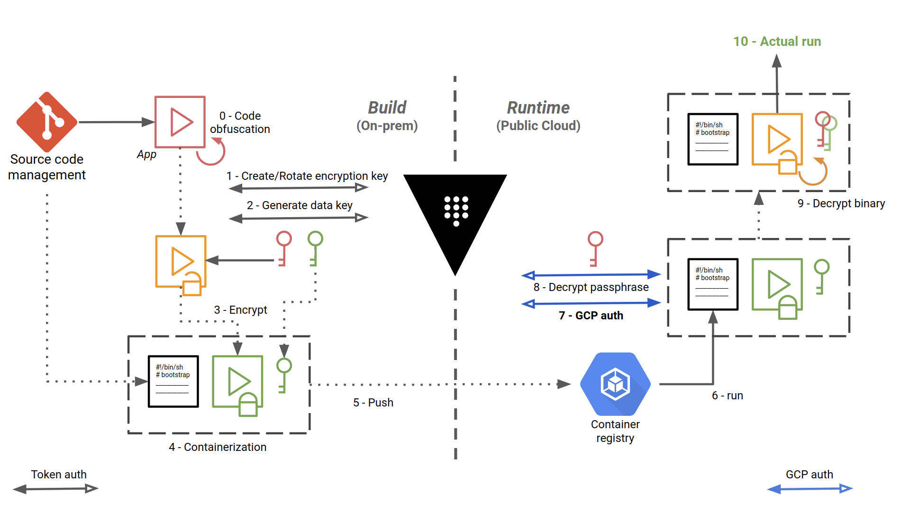
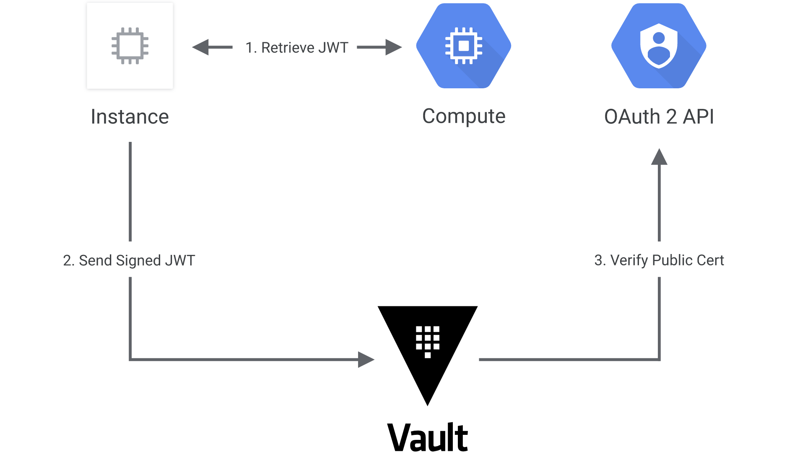

This project demonstrates a secured CI/CD pipeline for enclaved applications in the Cloud.
Enclaved applications are applications that can only be loaded and executed inside a trusted execution environment, here in this case a Kubernetes cluster in Google Cloud Platform (the solution can be adpated to other Cloud providers).

The containerized application is basically encrypted at build time, then decrypted at runtime, with the help of [Vault from Hashicorp](https://www.vaultproject.io/).

Asguard - this security solution for bringing sensitive apps into the Cloud - is named after the location of Ásgard in the Norse religion. Ásgard is an impregnable divine fortress surrounded by an impassable wall that shelters the gods from all invasions.

# Security requirements

The security requirements are the following:

- **Execution control**: We repeat what we said above in the introduction. The application must be “enclaved”, that means the application can only be loaded and executed inside a trusted execution environment, here in this case the targeted GCP project. The containerized application is basically encrypted at build time, then decrypted at runtime, with the help of Vault from Hashicorp. It should not be possible to decrypt the application outside of this execution context.

- **Access control**: _Out of scope here._  

- **Code obfuscation**: protection against reverse engineering. As a last bastion of security, and in the event that an attacker manages to grab the image, decrypt it and inspect it, the application source code must be obfuscated, so as to make it difficult for humans to understand.

# Secured CI/CD

We set up a CI/CD pipeline for building, securing and deploying the application into the targeted GCP project. Vault from Hashicorp is the corner stone of this workflow. Vault provides secrets management, and encrypting application data (without storing it).
In particular, you can generate, use, rotate, and destroy AES256, RSA 2048, RSA 4096, EC P256, EC P384 and EC P521 cryptographic keys.

The CI/CD pipeline, implemented with Gitlab CI/CD, is as follows:




The steps are numbered and detailed below:

0.   The source code is checked out, built and obfuscated
1. We create (first time) or rotate a key encryption key (KEK) in Vault. Here, we authenticate to Vault using a simple token, stored in a Gitlab protected environment variable
2. Envelope encryption: we implement a key hierarchy with a local data encryption key (DEK), protected by the KEK 
3. We make an archive out of the application, and we use the DEK to encrypt it using OpenSSL or GnuPG locally
4. We store the encrypted application in a Docker container image, along with the encrypted DEK and a bootstrap bash script that will be used at runtime to decrypt and start running the application.
5. We push the image in Google Container Registry
6. Self-starting process. The bootstrap script is the entrypoint of the Docker image. The workloads are orchestrated with Google Kubernetes Engine.
7. Here, we authenticate to Vault with a method specific to Google Cloud, detailed below
8. We decrypt the DEK, by giving to Vault the ciphertext and the name of the KEK to dec in the introduction. Typt against
9. We decrypt the archive locally with OpenSSL or GnuPG, and we unpack the application 
10. The application can finally do the job for which it is intended


# Vault GCE Auth workflow
The gcp auth method allows Google Cloud Platform entities to authenticate to Vault. Vault treats Google Cloud as a trusted third party and verifies authenticating entities against the Google Cloud APIs. This Vault backend allows for authentication of Google Cloud IAM service accounts, but here we are interested by authenticating Google Compute Engine (GCE) instances that make up our Kubernetes cluster.

The auth method must be configured in advance before machines can authenticate. In particular, we must declare that only the machines in the targeted GCP project, in certain zones and with certain labels will be able to authenticate.

Also, the GCE instances that are authenticating against Vault must have the following role: roles/iam.serviceAccountTokenCreator

In order to check the authentication process, Vault itself must authenticate to the Google Cloud Platform. For that, we specify the credentials of a service account with the minimum scope https://www.googleapis.com/auth/cloud-platform and the role roles/compute.viewer or a custom role with the following exact permissions:

- iam.serviceAccounts.get
- iam.serviceAccountKeys.get
- compute.instances.get
- compute.instanceGroups.list
- compute.instanceGroups.listInstances

These allow Vault to:

- Verify the service account, either directly authenticating or associated with authenticating GCE instance, exists
- Get the corresponding public keys for verifying JWTs signed by service account private keys.
- Verify authenticating GCE instances exist
- Compare bound fields for GCE roles (zone/region, labels, or membership in given instance groups)

The following diagram shows how Vault communicates with Google Cloud to authenticate and authorize JWT tokens:




1. The client obtains an instance identity metadata token on a GCE instance.
2. The client sends this JWT to Vault along with a role name.
3. Vault extracts the kid header value, which contains the ID of the key-pair used to generate the JWT, to find the OAuth2 public cert to verify this JWT.
4. Vault authorizes the confirmed instance against the given role, ensuring the instance matches the bound zones, regions, or instance groups. If that is successful, a Vault token with the proper policies is returned.

See [https://www.vaultproject.io/docs/auth/gcp/](https://www.vaultproject.io/docs/auth/gcp/) for even more details.


# Build  the image in local
Edit the Dockerfile to change the final image to ```:debug```.
You will get a busybox shell to enter, and you will be able to see the actual contents.

```
docker build -t asguard-demo \
        --build-arg VAULT_ADDR=https://vaulthost:8200 \
        --build-arg VAULT_ROOT_TOKEN_ID=s3cr3tt0k3n \
        --build-arg VAULT_KEY_NAME=aname .
```

then:

```
docker run -it --rm --entrypoint=sh asguard-demo:latest
```

You won't be able to run the result image on your machine with the default entrypoint, as the bootstrap script will attempt to authenticate to Vault with the GCP method. 

# TODO
- Sign bootstrap script
- Use Mozilla SOPS for storing secrets
- Use Kubernetes init container to bootstrap the app container
